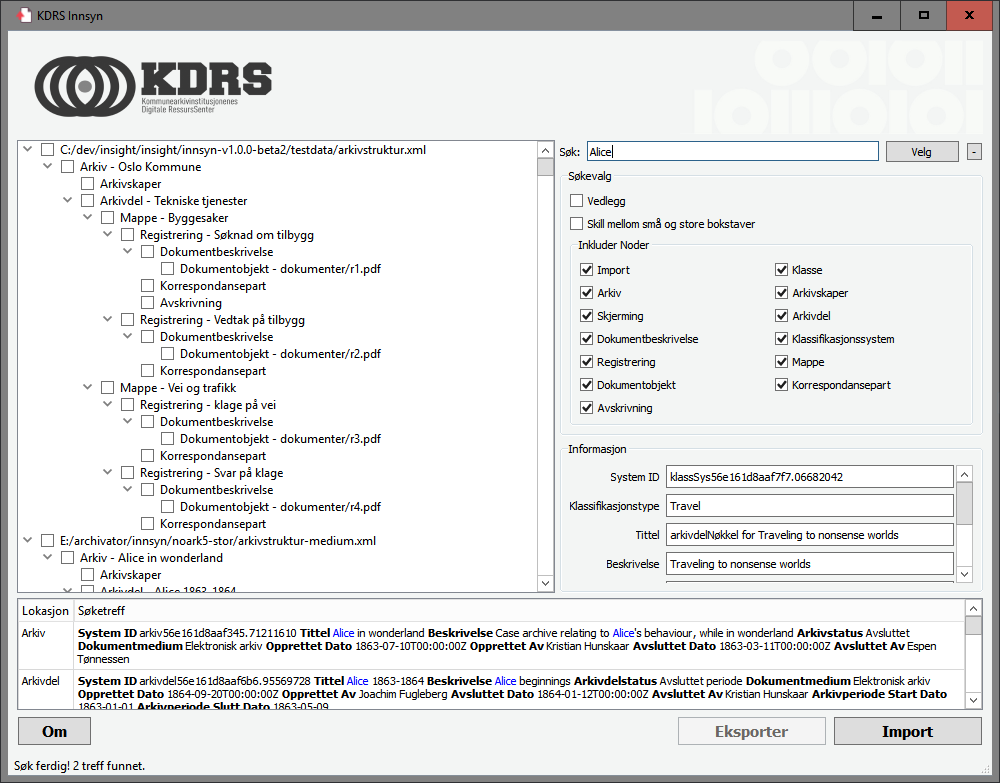

# Innhold

1.  [Introduksjon](#orgf5b5d05)
2.  [Systemkrav](#orga15da36)
    1.  [OS-X / Linux](#orgac9781a)
3.  [Installasjon](#orge92f3e9)
4.  [Bruk](#org4c379a8)
5.  [Sphinx indeksering og søkemotor](#orgcc9f055)
6.  [Rapporter](#orgbcb67e6)
7.  [Journaler](#org70e4406)
    1.  [Generering av PDF journaler med OCR](#org0fb50d1)
8.  [Loggfiler](#orgc41db0c)
9.  [Konfigurasjon](#orgaf5f781)
    1.  [Tips](#orgd19a310)
10. [Ønsker, feil og mangler](#org6ffb425)
11. [Hvordan rapportere feil](#org407b96d)
12. [Historikk](#org5ef6a5c)
    1.  [innsyn-v1.2.0-beta3](#org7dc5c43)
        1.  [Nye funksjoner](#org17ad561)
    2.  [innsyn-v1.2.0-beta1](#orgf84be56)
        1.  [Nye funksjoner](#orgec8a520)
    3.  [01.07.2020 innsyn-v1.1.0](#org43cbe36)
        1.  [Feilrettinger](#orge40eff9)
    4.  [innsyn-v1.1.0-beta2](#org9f2f394)
        1.  [Feilrettinger](#orga37774d)
    5.  [innsyn-v1.1.0-beta1](#org49f17d5)
        1.  [Nye funksjoner](#org2da6504)
        2.  [Feilrettinger](#org0dbd5f9)
    6.  [2018.06.01 innsyn-v1.0.0](#orga3e1d2e)
    7.  [2018.04.13 innsyn-v1.0.0-rc1](#org7cda307)
    8.  [2018.02.05 innsyn-v1.0.0-beta2](#orgfffaf47)
    9.  [2018.01.18 innsyn-v1.0.0-beta1](#org1dfe4b6)
13. [Utvikling](#orgee83663)
    1.  [Ubuntu](#orgc75a2c0)
    2.  [Windows](#org9712f2b)

# Introduksjon

Innsyn er en applikasjon som opprinnelig ble utviklet for Kommunenes Digitale Ressursjsentral (KDRS) for å støtte innsyn i NOARK-5 uttrekk. Applikasjonen har senere blitt utvidet til å støtte flere typer uttrekksformat.

Applikasjonen validerer ikke importformatene utover å sjekke at vedleggene finnes. Applikasjonen er datadrevet så langt det er mulig, dvs den har ikke innebygde referanser til filformat spesifike nøkkelord eller XML knagger. Istedenfor kontrolleres utsendet ved hjelp av innstillinger i konfigurasjonsfilen. Dette betyr at applikasjonen kan tilpasses til å støtte flere typer XML baserte format ved å kun endre konfigurasjonsfilene.

Innsyn kommer med støtte for disse filformatene:

-   NOARK-5: XML basert arkivformat brukt av stat og kommune i Norge.
-   EPJ avleveringsliste: XML basert dokumentasjonsformat brukt ved avlevering av pasientjournaler, fysiske eller elektroniske, til Norsk Helsearkiv.
-   EPJ pakkeliste: XML basert dokumentasjonsformat brukt ved avlevering av elektronsike pasientjournaler til Norsk Helsearkiv.
-   TAR: Filformat for som pakker mange filer sammen til en fil og bevarer filinformasjon (filnavn, dato, rettigheter). Innsyn støtter ikke utpakking av enkle tar filer, men viser strukturen.

# Systemkrav

Applikasjonen er testet på Windows 10 64bit.

## OS-X / Linux

Indekseringsverktøyet Sphinx må ligge i søkestien. Installeres enklest med Homebrew:

    osx$ brew install sphinx
    centos-redhat$ sudo yum install sphinx

Sjekk at det ligger i pathen med:

    datamaskin$ indexer 
    Sphinx 2.2.11-id64-release (95ae9a6)
    Copyright (c) 2001-2016, Andrew Aksyonoff
    Copyright (c) 2008-2016, Sphinx Technologies Inc (http://sphinxsearch.com)

# Installasjon

1.  Pakk ut *innsyn-v1.2.0.zip*.
2.  Indeksering av vedlegg kan bruke en del plass, rediger derfor eventuelt
    *REPORTS\_DIR* i *insight.conf* til å peke på en katalog med mye ledig
    diskplass.
3.  Språk i brukergrensesnittet kan settes ved å endre *LANGUAGE* i 
    *insight.conf*. Tilgjenelige språk er *engelsk*, *bokmål* og *nynorsk*. Standard språk er satt til bokmål. Vær obs på at språk ikke bør endres etter at programmet er tatt i bruk.

# Bruk

1.  Kjør *insight.exe* (mac/linux: insight) fra katalogen *innsyn-v1.2.0*.
2.  Brukergrensesnittet har fire hovedelementer:
    1.  **Nodetre**: Viser alle elementene i uttrekket i en trestrukture etter en import. 
        Hver node i treet tilsvarer en XML knagg. Nodetreet viser også tidligere 
        innlastede uttrekk. Disse kan lastes inn på nytt eller slettes
        ved å bruke knappene **Importer** og **Slett** i nodeinformasjon ruten.
    2.  **Nodeinformasjon**: Viser detaljert informasjon om en node. Enkelte 
        elementer har kanapper som lar deg utføre handlinger på informasjonen. 
        For eksempel har nodeelement som er vedlegg en **Vis** kanpp som lar 
        brukeren vise vedlegget med standard visningsverktøy som er registrert 
        for filformatet i operativsystemet.
    3.  **Søk**: Lar brukeren søke i importerte uttrekk.
    4.  **Søkeresultat**: Liste som kun vises når brukeren gjør ett søk.
3.  Trykk **Importer** for å laste inn ett NOARK-5 uttrekk. Ett lite
    testdatasett ligger under mappen *testdata*.
4.  Innlasting starter, for store uttrekk kan dette ta lang tid, men det er
    mulig å se på XML nodene mens innlastingen pågår.
5.  Når importeringen er ferdig blir brukeren spurt om vedleggene skal
    indekseres. Indekseringen kjører i bakgrunnen og kan ta lang tid avhengig av
    hvor mange vedlegg uttrekket inneholder. Første gang indekseringen kjører
    kan det hende at operativsystemets brannmur spør om godkjenning for
    prosessen *searchd.exe*, godta dette.
6.  Import genererer en rapport i rapport mappen, den kan åpnes fra rot noden
    i treet.
7.  Programmet har to hovedfunksjoner:
    1.  **Søk**: Fritekst søk på innholdet i nodene. Når søket starter
        så kommer en liste med søketreff frem. Dobbel-klikk å ett element i
        listen for å navigere til elementet i node treet. Søketreffene kan
        krysses av ved å trykke **Velg** knappen. Ved å klikke på **+** knappen ved siden av **Velg** knappen kan brukeren spesifisere hvordan søket skal fungere:
        a) **Vedlegg**: Vises kun hvis indekseringen er ferdig. Hvis den er avkrysset skjer søket mot vedleggene.
        b) **Skill mellom små og store bokstaver**: Hvis den ikke er avkrysset vil søketeksten *kdrs* gi treff på både *KDRS*, *kDrs* og *kdrs*. Hvis den er avkrysset vil den kun gi treff på *kdrs*.
        c) **Inkuder noder**: Lister alle unike tre node navn. Noder som ikke er avkrysset blir ikke tatt med i søkeresultatet.
        For å skjule de avanserte søkevalgene, trykk på **-** knappen.
    2.  **Eksporter**: Vil generere en rapport bestående av de nodene som er valgt
        i node treet. Rapporten kan lagres til disk eller sendes som vedlegg på
        e-post. Vær klar over at skjermet informasjon ikke skal sendes på vanlig e-post.

# Sphinx indeksering og søkemotor

For effektive fulltekstsøk mot dokumentene uttrekket refererer brukes Sphinx søkemotor. Først konverteres alle dokumentene til tekst, så bygger Sphinx en indeks som muliggjør raske søk.

Når Innsyn kjører og man har lastet og indeksert ett uttrekk, kan man kjøre SQL spørringer direkte om indeksen hvis man har MySql (versjon 5.6) klient installert:

    mysql -h0 -P9306
    MySQL [(none)]> show tables;
    +------------+-------+
    | Index      | Type  |
    +------------+-------+
    | INDEX_NAME | local |
    +------------+-------+
    1 row in set (0.00 sec)
    
    MySQL [(none)]> select i from INDEX_NAME where match('Oslo');

Se Sphinx manualen for mer informasjon.

# Rapporter

Etter import genereres en PDF-rapport i rapport katalogen, bestemt av
*REPORTS\_DIR* i *insight.conf*. Rapportene legges i en katalogstruktur på
formatet: *REPORTS\_DIR\\åååå\MM\DD\TTMMSS\\*.  I rapport katalogen
legges også loggfiler fra indekseringen og indekserings databasen.

# Journaler

For noen XML strukturer kan det være en 1 til mange relasjon mellom en node i XMLen og filer i arkivpakken. Et eksempel på dette er Norsk Helsearkiv arkivpakker der avlxml filen kan referere til flere digitaliserte sider og tilhørende OCR metadata.
Denne sammenhengen kan defineres i format filen med nøkkelen *INFO\_VIEW\_JOURNAL\_TYPE\_REGEXP*. Noder som treffer denne nøkkelen vi få en **Journal** knapp nederst i nodeinformasjon visningen.
Journal visningsmoduset lar brukerene velge ut enkeltsider i journalen som skal eksporteres. 

## Generering av PDF journaler med OCR

Journaler støtter visning og eksport av journaler som en *søkbar-PDF*, der hver side består av det digitaliserte bildet (feks en JPG) og den gjenskapte teksten (OCR) som et usynlig lag.
Støttet OCR format er ALTO og HOCR. For mer informasjon se scriptet *pdf\create-pdf.cmd*. For å generere PDFer kreves det at flere verktøy er installert og tilgjengelig i søkestien:

-   python: For kjøring av [HocrConverter.py](https://github.com/piql/HocrConverter) som genererer søkbare PDFer.
-   [pdftk](http://www.pdflabs.com/tools/pdftk-the-pdf-toolkit/): Slår sammen flere enkeltstående PDF sider til en PDF.
-   [alto\_\_hocr.xsl](https://github.com/filak/hOCR-to-ALTO): XSLT skjema for ALTO til hOCR konvertering

# Loggfiler

-   **innsyn-v1.2.0\insight.log**: Applikasjonslogg.
-   **innsyn-v1.2.0\insight.dmp**: Genereres hvis applikasjonen krasjer.
-   **REPORTS\_DIR\YYYY\MM\DD\TTMMSS\attachments.log**: Logg over konvertering av vedlegg til søkbare tekstfiler.
-   **REPORTS\_DIR\YYYY\MM\DD\TTMMSS\indexer.log**: Logg fra indekserings applikasjonen som genererer indekserings databasen.
-   **REPORTS\_DIR\YYYY\MM\DD\TTMMSS\sphinx\test1\searchd.log**: Logg fra søkemotoren.

# Konfigurasjon

Konfigurasjonsfilen heter *insight.conf*. Se i denne filen for dokumentasjon på hva som kan konfigureres. Ved endring må applikasjonen restartes. Hvert enkelt filformat har sin egen konfigurasjonsfil. De ligger i mappen *formats*. Alle filene som slutter på *.conf* i denne katalogen vil ved oppstart leses inn og vises som ett eget import format i applikasjonen. 

## Tips

-   Kommer vinduet opp veldig lite og har sammentrykte knapper på Windows?
    Det kan være at du kjører i emulator eller har en skjerm med høy oppløsning. 
    Prøv med `insight -platform windows:dpiawareness=0` for å få riktig størrelse på vinduet. Beskrivelse av andre parametere som tweaker utseendet finnes her: <https://doc.qt.io/qt-5/qguiapplication.html#supported-command-line-options>

# Ønsker, feil og mangler

-   [RA-20181209-01] Innlesing av arkivstruktur til minne, denne topper lett ut ved 8 GB minne ved det største arkivuttrekket som er prøvd. I tillegg medførte antatte feilmeldinger i bakgrunnen til at pcen saknet betraktelig, før den til slutt ikke svarte og trengte hard omstart.
-   [RA-20181209-02] Programmet mangler klar tilbakemelding om når en handling er ferdig, kan fint stå lang tid på 100% og jobbe.
-   [RA-20181209-03] Det er en grunn til at uttrekksleverandører lager mapper med maks 5000 filer per mappe: FAT-partisjoner har et tak på 65,534 filer per mappe, mens NTFS har et tak på 4,29 milliarder. En idé til vedleggs-mappen.
-   [RA-20181209-04] For det andre arkivuttrekket ble vedlegg-filen dumpet lenge etter indeksering var ferdig, tyder på at oppgaven ble forsøkt utført i minne. Pga. flertråds-løsningen er dette forståelig, men lite ønsket (stort minneforbruk).
-   [IKAMR-20180515-01] Du burde kanskje hatt en boks med informasjon eller på en eller annen måte oversiktlig vist hvilke uttrekk du faktisk har åpen no som kan søkes i?
-   [IKAMR-20180515-02] Det samme gjelder treff i søk, hvordan vet jeg hvilken av uttrekkene søket fant sine treff i?
-   [IKAMR-20180514-01] Etter å ha lukket uttrekk: Her står "Import ble avbrutt av brukeren", mener programmet at jeg har avbrutt fordi jeg klikket LUKK?
-   [IKAMR-20180514-01] Info etter at indeksering er ferdig bør vises i en egen dialogboks. (Infobar nederst har ikke nok plass til å vise all informasjon.)
-   [IKAMR-20180514-01] Begrensing som gjør at nodetree med over 200.000 elementer ikke kan minimeres (kollapses) er problematisk når flere samtidige uttrekk er lastet inn.
-   [IKAMR-20180425-01] Savner FRITEKST søk, dvs. at om jeg skriver Ola Normann og der er egne xml elemetner for <foranvn>Ol</fornavn> og <etternavn>Normann</Normann> så vil jeg få et treff i fritekstsøk. Full fritekstsøk bør være en avkrysningsboks, fordi avgrenset søk UTEN full fritekst vil være normalen i Noark 5-sammenheng og ellers? Så hvis jeg får mitt ønske gjennom får vi både punkt 1. Avansert søk feltnivå i forrige epost, OG 4. FRITEKST søk som nevnt her.
-   [IKAMR-20180424-01] Mer avansert søk på feltnivå (som <xml elementnavn 1>=<verdi 1> OG / ELLER <xml elementavn 2>=<verdi 2> osv.
-   [IKAMR-20180424-02] Når jeg har fått et resulat, f. eks. 9 treff på et etternavn, så finner jeg ikke en enkel måte å velge "merk alle" på. Høyreklikk velg alle f. eks.? Da kan jeg bla gjennom til venstre de som er avkrysste og ev. ta vekk de som ikke er aktuelle
-   [IKAMR-20180424-03] Vis kun valgte (avkryssede). Noe som er meget relevant i et Noark 5-utvalg også etter søk.
-   [KDRS-20180315-04] Se på framtidig mulighet til å koble seg til KS sin FIKS plattform for sending av informasjon til innbygger
-   [KDRS-20180315-06] Se om det er mulig å få med antall funne rader – og ikke bare vist
-   [IKAVA-20180308-01] Søk knappen burde muligens vært tilknyttet søkeresultat-området i GUI, og at knappen oppe ved søk beholdt "Søk" teksten, for nytt søk.
-   [IKARO-20180125-03] Avkrysning i sjekkboksene (nodene) bør ta med seg underliggende noder.
-   [IKAMR-20180120-06] "Lagre som snarvei" en sti og enkel gjenbruke de lagrede snarveier.
-   [IKAMR-20180120-09] Vise antall søketreff.
-   [IKAMR-20180120-10] Vise antall treff for forskjellige kategorier.
-   For store node tre så kan kollapsing og så ekspandering av noder ta
    lang tid. Dette er derfor slått av for nodetre med flere enn 200.000
    noder.
-   Får ikke advarsel hvis indeksering starter og det er igjen lite plass
    på disken.

# Hvordan rapportere feil

ole.liabo@piql.com  
Ved feilrapportering legg ved loggfiler og ved programkrasj *insight.dmp* hvis den finnes.

# Historikk

## innsyn-v1.2.0-beta3

### Nye funksjoner

-   Støtte for automatisk nodevalg, settes per format med *TREEVIEW\_AUTO\_SELECT\_REGEXP* variablen.
-   Støtte for automatisk skjuling av barne noder ved import med *TREEVIEW\_AUTO\_COLLAPSE\_REGEXP* variablen.
-   Journaler inkluderes ved eksport.
-   Bakgrunnsmodus: Støtter autoeksport med kommandolinjeparameterene *&#x2013;file*, *&#x2013;file-format* og *&#x2013;auto-export*.

## innsyn-v1.2.0-beta1

### Nye funksjoner

-   Støtte for standard ut mappe ved eksport, settes med konfigurasjonsvariablen *FIXED\_REPORT\_EXPORT\_FOLDER*.
-   Søtte for journaler

## 01.07.2020 innsyn-v1.1.0

### Feilrettinger

-   Opptegning av info nodeinformasjon: Vise all tekst for noder, og likt mellomrom mellom alle noder.
-   Lese inn konfig filer som UTF-8 på Windows.

## innsyn-v1.1.0-beta2

### Feilrettinger

-   Installasjon for Windows.

## innsyn-v1.1.0-beta1

### Nye funksjoner

-   Støtte for å definere nye XML importformat i egen konfigurasjonsfil. Dette gjør det mulig å styre hvordan hvert enkelt format skal presenteres i node treet og i informasjonspanelet.
-   Støtte for import av TAR filer og andre pakkeformater. Filen pakkes ut under rapport mappen og indekseres.
-   Støtte for import av dokumenter som refereres fra hoveddokumentet. Det importerte dokumentet lastes inn og blir en del av nodetreet.
-   Støtte for sjekksumvalidering av filer referert fra node treet.
-   Støtte for å endre XML-løv noder basert på både node navnet og innholdet i noden.

### Feilrettinger

-   Oppsett av Sphinx indexer og søkemotor på Linux / OS-X.
-   Melding etter konvertering av vedlegg. Får beskjed både om at konvertering feilet og at vedlegg er tomme.

## 2018.06.01 innsyn-v1.0.0

-   [IKAMR-20180425-02] BUG på norske tegn i søk? Hvis her er norske tegn så virker ikke "Skill mellom små og store bokstaver" som IKKE avkrysset dvs. <fornavn>TORBJØRN</fornavn> vil ikke få treff når jeg søker med "Torbjørn".

## 2018.04.13 innsyn-v1.0.0-rc1

-   [IKAVA-20180122-03] Inkluder dokumentnavn i nodetree visningen.
-   [IKARO-20180223-02] Bør kunne slette ved å høyreklikke på root node i treet.
-   [IKAMR-20180120-04] Enkel brukerveiledning.
-   [IKARO-20180125-06] Help evt. kort brukerveiledning.
-   [KDRS-20180315-01] Statistikk på hvor mange dokumenter som ikke inneholder tekst, og hvor mange med tekst.
-   [KDRS-20180315-02] Advarsel på tidsbruk ved indeksering av pdf-er
-   [KDRS-20180315-03] Advarsel i forbindelse med «send på e-post»
-   [IKAVA-20180308-02] Søk skal ikke se forskjell på små og store bokstaver.
-   [KDRS-20180315-07] Neste knapp i søkeresultat.
-   [KDRS-20180315-05] Muligheter for utvidet søk – med å kunne avgrense søkeobjektene – slik at en kan raffinere søket bedre
-   [KDRS-20180315-08] Telle antall valge noder.
-   [IKARO-20180223-03] Importer kanppen får teksten Rapport.
-   [IKAVA-20180122-01] Mindre info ved søk, filtrere vekk "uninteressante" felter i søkeresultat.
-   [IKARO-20180125-01] På Public 360 4.1 krasjet arkivstruktur.xml og arkivuttrekk.xml.
-   [IKARO-20180125-02] På Visma VSA 2.3.5 krasjet det på arkivuttrekk.xml.
-   [IKAMR-20180120-12] Krasj ved import.
-   [IKARO-20180223-01] Jeg har en rekke tidligere kjøringer listet i hovedvinduet når jeg starter opp. Disse er tomme. Hvis jeg prøver å «Åpne» en av disse, så krasjer Insight. Det blir ikke lagt en insight.dmp. Dette skjer hver gang.

## 2018.02.05 innsyn-v1.0.0-beta2

Oppdateringer basert på tilbakemeldinger fra IKA-MR, IKA-VA og IKA-Rogaland.

-   [IKAMR-20180120-01] Standard filnavn "arkivstruktur.xml".
-   [IKAMR-20180120-08] Mulighet til å laste inn allerede importerte uttrekk.
-   [IKAMR-20180120-13] Flere åpne arkiv samtidig, søk på tvers av arkiv.
-   [IKAMR-20180120-07] Rutiner for å "rydde" opp data.
-   [IKAMR-20180120-03] Flere avkryssingsmuligheter i nodetree: "Velg alle underliggende", "Fjern alle underliggende"
-   [IKARO-20180125-04] Burde huske siste Import og Eksport-mappe.
-   [IKAMR-20180120-05] Huske sist brukte Eksport eller Import mappe.
-   [IKARO-20180125-05] About box.
-   [IKAMR-20180120-11] Sortering på kategori.
-   [IKAMR-20180120-02] Dato format i rapport: "Lørdag 20.01.2018 19:32:59".
-   [IKAVA-20180122-02] Unngå at lokasjon brekker over to rader, evt la bruker styre bredden.
-   [PIQL-20180122-01] Konfigurasjonsfil bedre dokumentert.
-   [PIQL-20180122-02] Generere filen insight.dmp ved programkrasj.
-   [PIQL-20180122-03] Viser størrelsen på vedlegg ved import.

## 2018.01.18 innsyn-v1.0.0-beta1

Første versjon levert til beta test.

# Utvikling

Programmet er laget ved hjelp av Qt rammeverket. Er dette installert kan man bygge med:

    (cd src/thirdparty ; unzip quazip-0.7.3.zip)
    ./update-translations.sh
    qmake
    make

Det kan også være nødvendig å bygge MySql driveren, se her for detaljer: <https://doc.qt.io/qt-5/sql-driver.html#qmysql-for-mysql-5-and-higher>

For å lage installasjons pakker kan man bruke noen av de vedlagte skriptene:
create-release-osx.sh
create-release.cmd

## Ubuntu

sudo apt install libpoppler\*
sudo apt install libboost-all-dev
sudo apt install libquazip5-dev
sudo apt install qttools5-dev-tools

## Windows

    setup-win64.cmd
    qmake -tp vc

Her må man bygge poppler manuelt. 

