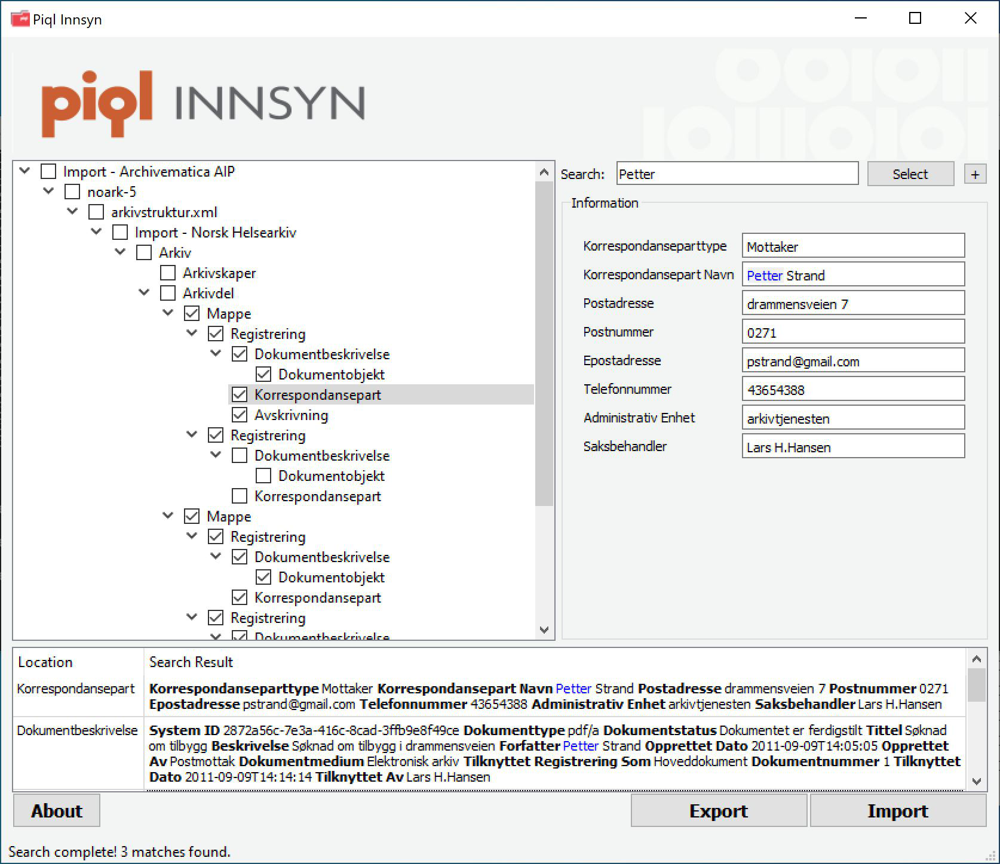
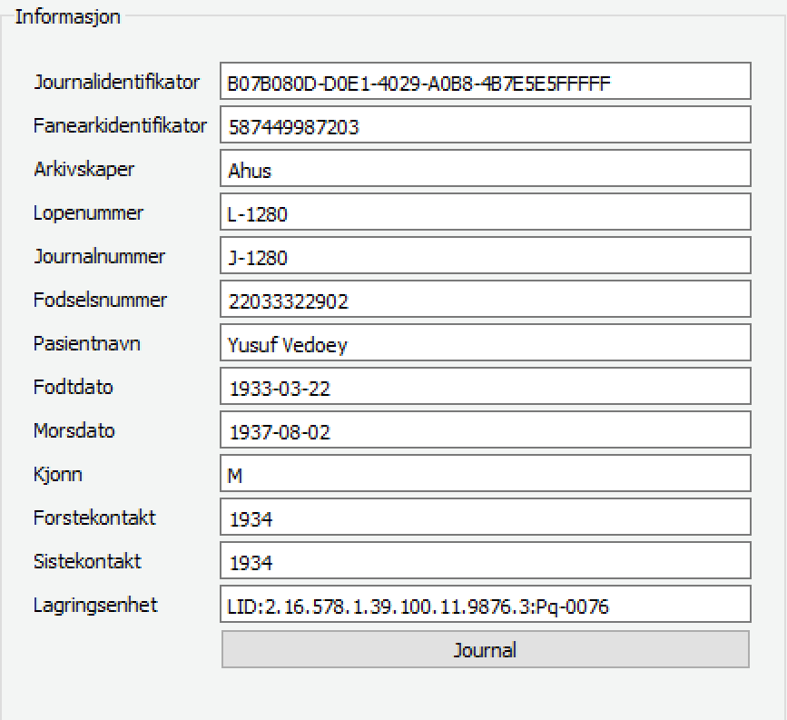

# Table of Contents

1.  [Introduction](#orgf8a74d2)
2.  [About](#org04041f2)
3.  [System Requirements](#org417adae)
    1.  [OS-X / Linux](#orgcfbb6b0)
4.  [Installation](#org679ec9d)
5.  [Usage](#org9b7a1cb)
6.  [Sphinx indexer and search engine](#org88b9ded)
7.  [Reports](#orga28b81f)
8.  [Journals](#orgabe3d53)
    1.  [Creating *searchable-PDFs*](#org4bc7055)
9.  [Log files](#orgbaf2dbd)
10. [Configuration](#org9a1e7a2)
    1.  [Tip](#org4ba8149)
11. [Batch mode](#orgddd2e74)
12. [How to report issues](#orge158d15)
13. [History](#org63997a5)
    1.  [insight-v1.2.0](#org0d7fdcd)
    2.  [insight-v1.2.0-beta3](#orgc0102c8)
        1.  [New features](#org9df6a3d)
    3.  [innsyn-v1.2.0-beta1](#org819272d)
        1.  [New features](#org12f1b7a)
    4.  [01.07.2020 innsyn-v1.1.0](#org1fc15bd)
        1.  [Fixes](#org78a5631)
    5.  [innsyn-v1.1.0-beta2](#org31b8010)
        1.  [Fixes](#orgeccf1fc)
    6.  [innsyn-v1.1.0-beta1](#orge4f5804)
        1.  [New features](#org1a99b84)
        2.  [Fixes](#org9e30c35)
    7.  [2018.06.01 innsyn-v1.0.0](#org7aaa33e)
        1.  [Fixes](#org97d791c)
    8.  [2018.04.13 innsyn-v1.0.0-rc1](#org0aa8db4)
    9.  [2018.02.05 innsyn-v1.0.0-beta2](#org9d26b4c)
    10. [2018.01.18 innsyn-v1.0.0-beta1](#org431ad64)
14. [Development](#org24540bc)
    1.  [Ubuntu](#org5467307)
    2.  [Windows](#org8275eb6)

# Introduction

*Piql Insight* is a fast and flexible archival package / information package (IP) inspection and dissemination tool. 

The application does not validate the IPs apart from validating the existence of attachments. The application is data-driven and a design goal is that is should not contain any references to file formats, XML-tags or keywords. Instead are the views controlled by configuration files and optional regular expressions to transform the XML to user interface friendly keywords. This means that in principle the application can support any XML based IP based format by adding new config files.

For efficient dissemination the application supports batch mode exports with predefined transformations. It also supports creating *searchable-PDFs* where the PDF contains digitized page and embedded OCR metadata.

Insight ships with these formats:

-   NORAK-5: Used by Norwegian legislation to archive government journals.
-   EPJ shipping list: Used when submitting patient journals, either paper or electronic, to an archive.
-   EPJ package list: Used when submitting electronic patient journals to the Norwegian Health Archive.
-   TAR: Insight opens tar files and shows its content. XML files inside the tar can be further examined.

# About

Piql Insight was originally developed for the *Kommunenes Digitale Ressursjsentral (KDRS)* in Norway and released under the name *KDRS Innsyn*. Its job was to support dissemination of archival packages in the *NORAK-5* format, used by the Norwegian legislation. It has later been extended to support multiple IP formats.

# System Requirements

Released applications are tested on Windows 10 64bit.

## OS-X / Linux

The text indexer tool Sphinx must be in the path. 

Install:

    osx$ brew install sphinx
    centos-redhat$ sudo yum install sphinx

Check that tool is available:

    computer$ indexer 
    Sphinx 2.2.11-id64-release (95ae9a6)
    Copyright (c) 2001-2016, Andrew Aksyonoff
    Copyright (c) 2008-2016, Sphinx Technologies Inc (http://sphinxsearch.com)

# Installation

1.  Extract *insight-v1.2.0.zip*.
2.  Indexing of attachments can require some disk space, consider changing data location
    *REPORTS\_DIR* in *insight.conf* and ensure it points to a location with sufficient disk space.
3.  UI language can be changed by editing *LANGUAGE* in *insight.conf*. Current available languages are *english*, *norwegian-bokmål* and *norwegian-nynorsk*. Default language is *english*. Please note that changing language after launch can cause trouble since some of the paths are localized.

# Usage

1.  Launch *insight.exe* (OS-X/Linux: insight) from *innsyn-v1.2.0*.
2.  The UI has four main elements:
    1.  **Node tree**: Shows all the elements in the imported XML/package. Each node in the tree corresponds to an XML tag or a file. It also shows previously loaded packages. These can be reloaded or deleted by using the **Import** or **Delete** buttons in the node-info window.
    2.  **Node info**: Shows detailed info for each node. Some elements have action buttons attached to them. For example has the element for attachments a **Display** button that allows the user to display the attachment with the viewer the operating system has associated with this file format.
    3.  **Search**: Allows users to search in loaded packages.
    4.  **Search result**: Only displayed after a search.
3.  Press **Import** to load a package. Sample data can be found under *testdata*.
4.  The loading will start. For large packages this can take some time, but the UI should instantly start to populate the node tree.
5.  When the import is complete, the user is asked if the application should index the attachments. The indexer runs in the background and indexing duration will depend on number of and size of attachments. Windows: At first launch the OS might ask for firewall approval for the *searchd.exe* process, please approve this.
6.  Import generates a report file, this can be opened from the root node of the package.
7.  The application has two main functions:
    1.  **Search**: Free text search in the node tree. When the search starts, the list of search results will appear. Double-click an element in the list to navigate to the element in the node tree. Select a item using the **Select** button. For advances search options press the **+** button next to the **Select** button:
        a) **Attachments**: Only displayed if attachment indexing is complete. When selected attachments will be searched instead of the node tree.
        b) **Case sensitive**: If not checked the search string *findme* will match both *FINDME*, *findMe* and *findme*. If checked it will only match *findme*.
        c) **Include nodes**: Displays all unique node names in the node tree. Nodes not checked will be excluded from the search.
        To hide the advanced search options press the **-** button.
    2.  **Export**: Generate a report of selected nodes in the node tree. The report can be saved to disk or sent as an attachment in e-mail. Please note security requirements for disseminated material before sending on e-mail.

# Sphinx indexer and search engine

For efficient full text searches in the attachments referenced by the archival package the search engine Sphinx is used. First all attachments are converted to text, then Sphinx builds and index to facilitate efficient look-ups.

With insight running and after loading and indexing an archival package, it is possible to run SQL queries directly on the index with MySQL (version 5.6) client installed:

    mysql -h0 -P9306
    MySQL [(none)]> show tables;
    +------------+-------+
    | Index      | Type  |
    +------------+-------+
    | INDEX_NAME | local |
    +------------+-------+
    1 row in set (0.00 sec)
    
    MySQL [(none)]> select i from INDEX_NAME where match('Drammen');

See Sphinx user manual for more information.

# Reports

After import a PDF-report is generated it the report folder as configured by the *REPORTS\_DIR* key in *insight.conf*. The reports are stored in a folder named *REPORTS\_DIR\yyyy\MM\DD\TTMMSS\\*. In the report folder the Sphinx index and similar data attached to the IP is stored.

# Journals

For some XML based formats there can be a one to many relation between a node in the XML and files in the archival package. An example of this is the Norwegian Health Archive package where the *avlxml.xml* file can reference multiple digitized pages and corresponding OCR metadata. This relationship can be configured using the key *INFO\_VIEW\_JOURNAL\_TYPE\_REGEXP* in the import format file. Nodes matching this key will get a **Journal** button at the bottom of the node view. The Journal view allows users to select pages that should be exported.

## Creating *searchable-PDFs*

The journal mode supports display and export of journals as *searchable-PDF* where each page consists of the digitized page (for example in JPEG format) an the recognized text (OCR) as an invisible layer.

Supported OCR formats are ALTO and HOCR. For more information how this mode works study the script *pdf\create-pdf.cmd*. To create PDFs several tools have to be installed and available in the system path:

-   python: To run [HocrConverter.py](https://github.com/piql/HocrConverter) responsible for generating PDFs.
-   [pdftk](http://www.pdflabs.com/tools/pdftk-the-pdf-toolkit/): Combines multiple PDFs into one.
-   [alto\_\_hocr.xsl](https://github.com/filak/hOCR-to-ALTO): XSLT scheme for translating from ALTO to hOCR OCR format.

# Log files

-   **insight-v1.2.0\insight.log**: Application log.
-   **insight-v1.2.0\insight.dmp**: Generated on Windows if application crashes.
-   **REPORTS\_DIR\YYYY\MM\DD\TTMMSS\attachments.log**: Attachments to text convert log.
-   **REPORTS\_DIR\YYYY\MM\DD\TTMMSS\indexer.log**: Log from Sphinx indexer.
-   **REPORTS\_DIR\YYYY\MM\DD\TTMMSS\sphinx\test1\searchd.log**: Log from Sphinx search engine.

# Configuration

The config file is named *insight.conf*. The goal of the config file is that it is self documenting, so inspect it for further details. If the config file is changed the application has to be restarted. Each import format has its own config file stored under *formats*. All files ending with *.conf* in this folder will be loaded at startup and displayed in the file open dialog. 

## Tip

-   Does the application window appear small and has compact buttons on Windows?
    It could be that the application is running in an emulator or has a screen with high resolution. Try launching the app `insight -platform windows:dpiawareness=0` to get correct window size. Description of other parameters influencing user interface are documented here: <https://doc.qt.io/qt-5/qguiapplication.html#supported-command-line-options>

# Batch mode

    
    +-------------+     +---------+     +-----------------+
    | Archival    |     |         |     | Searchable PDF  |
    | Information +---->| Insight |---->| with            |
    | Package {d} |     |         |     | OCR {d}         |
    +-------------+     +---------+     +-----------------+

To support automated dissemination workflows Insight support batch mode using the command line parameters: *&#x2013;file*, *&#x2013;file-format* and *&#x2013;auto-export*.

# How to report issues

Please create a GitHub issue with a detailed as possible description of what happened. Attach log files and *insight.dmp* if it exists. Do not post sensitive material!

# History

## insight-v1.2.0

-   Translated user manual to English.

## insight-v1.2.0-beta3

### New features

-   Support for automatic node selection, as defined using the *TREEVIEW\_AUTO\_SELECT\_REGEXP* key.
-   Support for automatic hideing of child nodes using the *TREEVIEW\_AUTO\_COLLAPSE\_REGEXP* key.
-   Journals are included at export.
-   Batch mode: Support automatic export using the command line options: *&#x2013;file*, *&#x2013;file-format* and *&#x2013;auto-export*.

## innsyn-v1.2.0-beta1

### New features

-   Support for a fixed export folder, configured using *FIXED\_REPORT\_EXPORT\_FOLDER*.
-   Support journal.

## 01.07.2020 innsyn-v1.1.0

### Fixes

-   Node information: Show all text for nodes and fix spacing issue.
-   Read config files as UTF-8 on Windows.

## innsyn-v1.1.0-beta2

### Fixes

-   Install for Windows.

## innsyn-v1.1.0-beta1

### New features

-   Support for custom import formats.
-   Support TAR files.
-   Support for loading referenced files.

### Fixes

-   Setup Sphinx for Linux / OS-X.

## 2018.06.01 innsyn-v1.0.0

### Fixes

-   Matching for special chars.

## 2018.04.13 innsyn-v1.0.0-rc1

Pre release.

## 2018.02.05 innsyn-v1.0.0-beta2

Pre release.

## 2018.01.18 innsyn-v1.0.0-beta1

First beta test release.

# Development

The application is created using the Qt framework. When this is installed the application can be build using:

    (cd src/thirdparty ; unzip quazip-0.7.3.zip)
    ./update-translations.sh
    qmake
    make

On systems the MySQL driver has to be built:
<https://doc.qt.io/qt-5/sql-driver.html#qmysql-for-mysql-5-and-higher>

To create release packages use:

    create-release-osx.sh
    create-release.cmd

## Ubuntu

    sudo apt install libpoppler*
    sudo apt install libboost-all-dev
    sudo apt install libquazip5-dev
    sudo apt install qttools5-dev-tools

## Windows

    setup-win64.cmd
    qmake -tp vc

Poppler PDF library have to be compiled manually.

